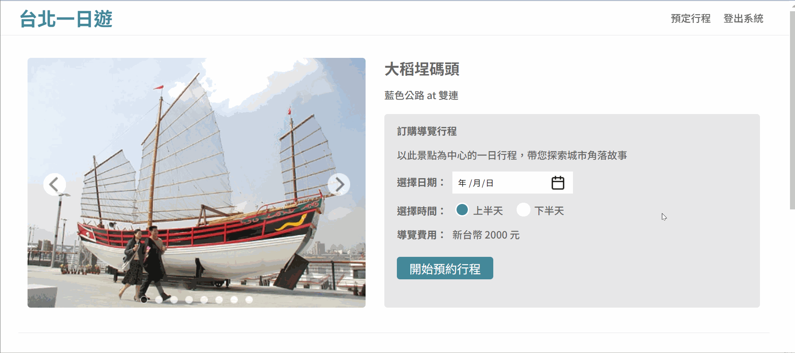
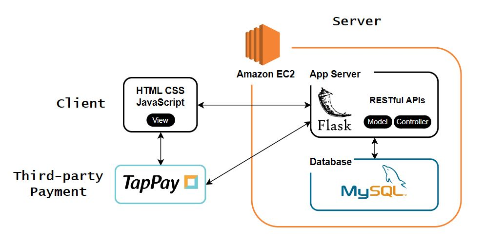
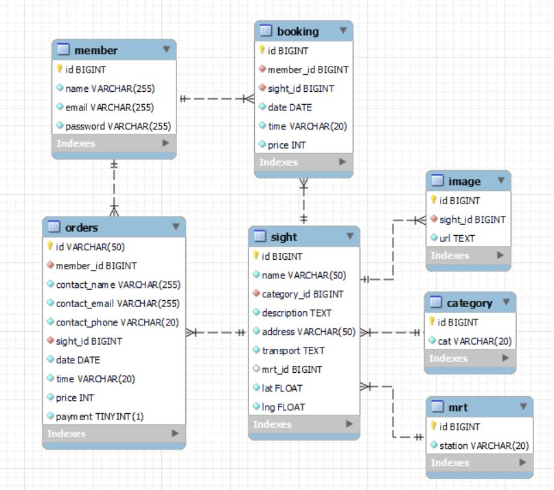

<h1 align="center"> Taipei Day Trip 🗺️</h1>

 <i>"Taipei Adventures at Your Fingertips: Explore, Experience, and Enjoy!"</i>

🧭 Taipei Day Trip is an e-commerce website where you can discover tourist attractions in Taipei and book day tours of the sights.

🔗 Website URL: https://taipeidaytrip.ysirene.online/

👨‍💻 Testing Account:

- Email: `test@test.com`
- Password: `test`

💰 Testing Payment Information:

- Card Number: `4242-4242-4242-4242`
- Expiration Date: `0125`
- CVV: `123`

## Main Feature

- Infinite Scroll

- Search for attractions by keywords or MRT.

- Shopping Cart System

- Responsive Web Design (RWD)

- Connect to the database using connection pool and optimize queries with index settings.

## Architecture

## Techniques

### Backend

- Framework: Python Flask
- SSR: Jinja2
- Database: MySQL
- Cloud Service: AWS EC2
- Authentication: JSON Web Token (JWT)

### Frontend

- HTML
- CSS
- JavaScript
- AJAX

#### Other

- Version Control: Git/Github

## Database Schema

## Contact Me

😺 Ya-Shan Lee

📧 leeys2423@gmail.com
